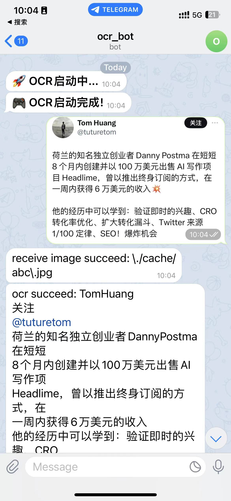

# TeleOCRBot

TeleOCRBot 是一个使用 Python 编写的OCR工具，通过telegram bot交互。

## 使用

首先，你需要创建一个 Telegram bot，然后获取 API token。你可以参考 [Telegram 官方文档](https://core.telegram.org/bots/features#botfather) 来创建一个 Telegram bot。

然后，你需要获取你希望接收警告的 Telegram chat ID。你可以使用 [@userinfobot](https://t.me/userinfobot) 来获取你的 chat ID。

接下来 clone 这个项目：

```bash
git clone https://github.com/Colin-coder/TgOCRBot.git
```

根据example.env构建.env

```bash
cp example.env .env
```

下面是 TeleOCRBot 的环境变量：

- `TG_API_TOKEN`: 你的 Telegram bot 的 API token。
- `TG_CHAT_ID`: 你希望接收警告的 Telegram chat ID。
- `TG_API_BASE_URL`: Telegram API 的基础 URL，默认值为 `https://api.telegram.org`.

下面是机器人的命令：

- /start - 获取帮助
- /help - 获取帮助
- 发送图片，Bot返回OCR识别信息

### 如果你不能访问Telegram API

你可以使用下面项目创建一个 api 代理，并且修改环境变量 TG_API_BASE_URL

[teleproxy](https://github.com/bboysoulcn/teleproxy)

### 效果展示



## TODO
- 支持 docker compose

## 贡献者

- [Colin](https://github.com/Colin-coder)

## 许可证

这个项目使用 MIT 许可证，详情请见 [LICENSE](LICENSE) 文件。
